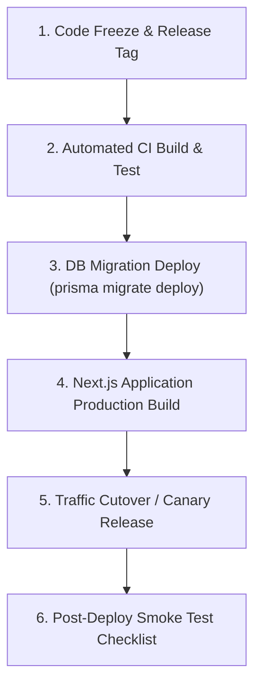

# Enterprise Production Deployment Runbook

## 1. Pre-Deployment Verification Checklist
- [ ] All Vitest active test suites passing (70/70 tests).
- [ ] `npm run build` succeeds cleanly with Exit Code 0.
- [ ] 0 TypeScript errors & 0 ESLint errors.
- [ ] Database backup snapshot triggered prior to release.
- [ ] Production environment variables verified in Secrets Manager.

---

## 2. Standard Deployment Sequence



### Command Execution Sequence:
```bash
# 1. Fetch latest release branch
git checkout main && git pull origin main

# 2. Execute database migrations safely
npx prisma migrate deploy

# 3. Build production bundle
npm run build

# 4. Start production server
npm run start
```
